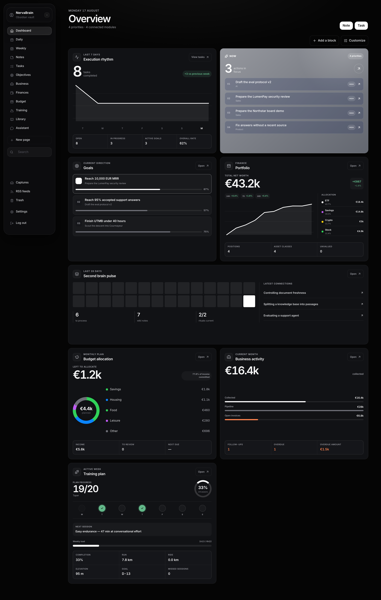
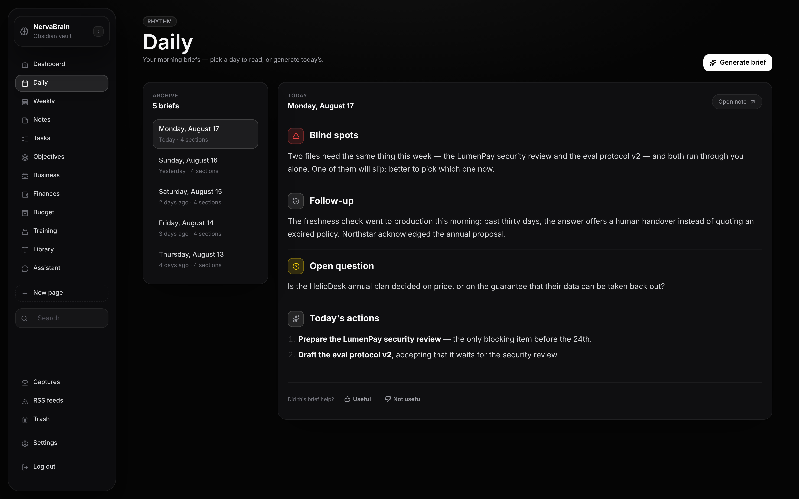
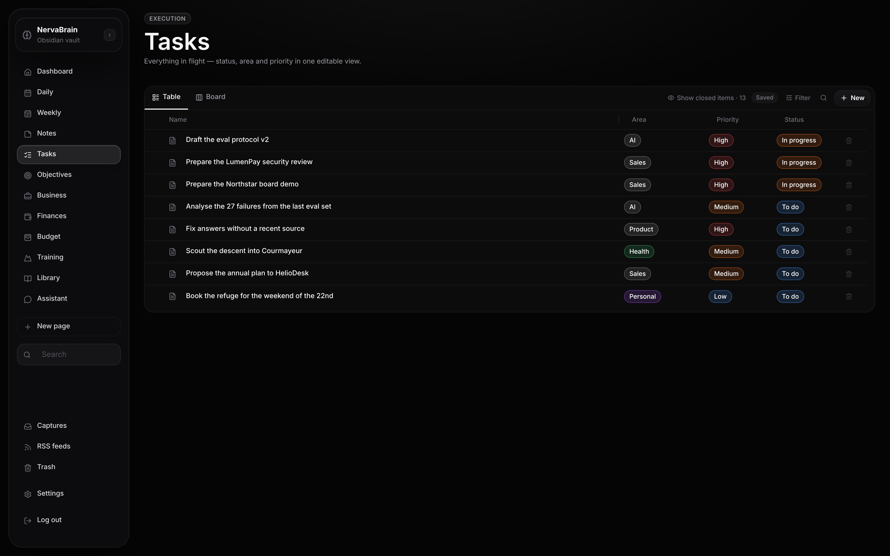
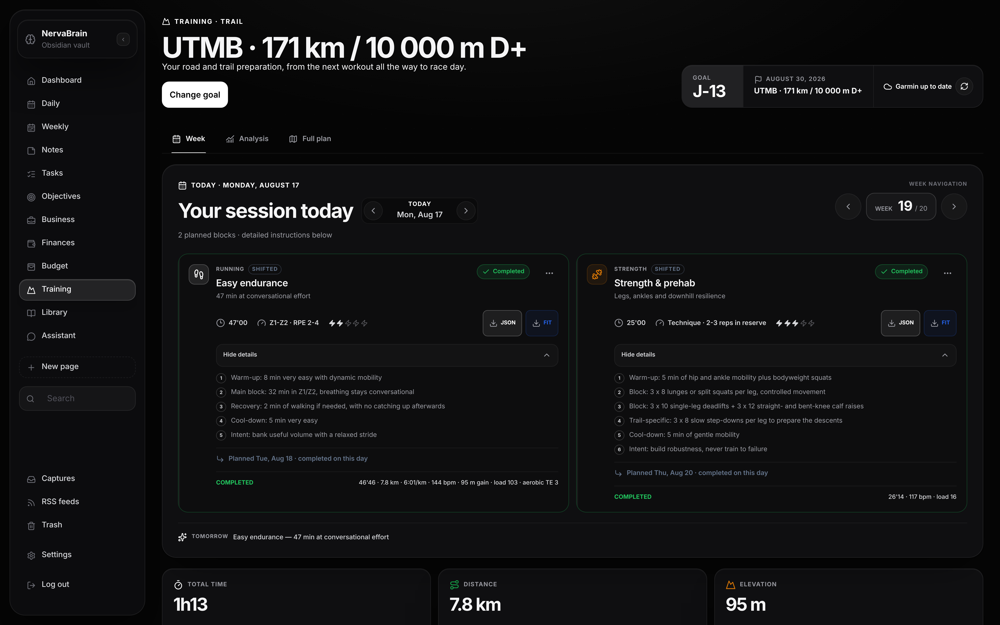
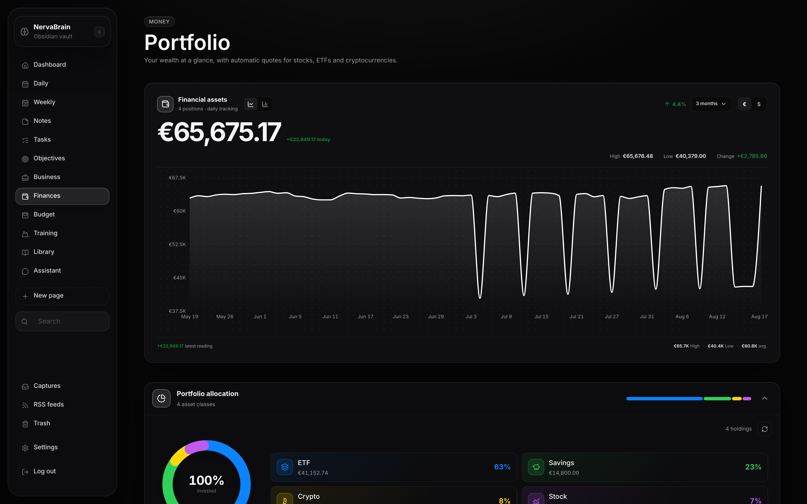
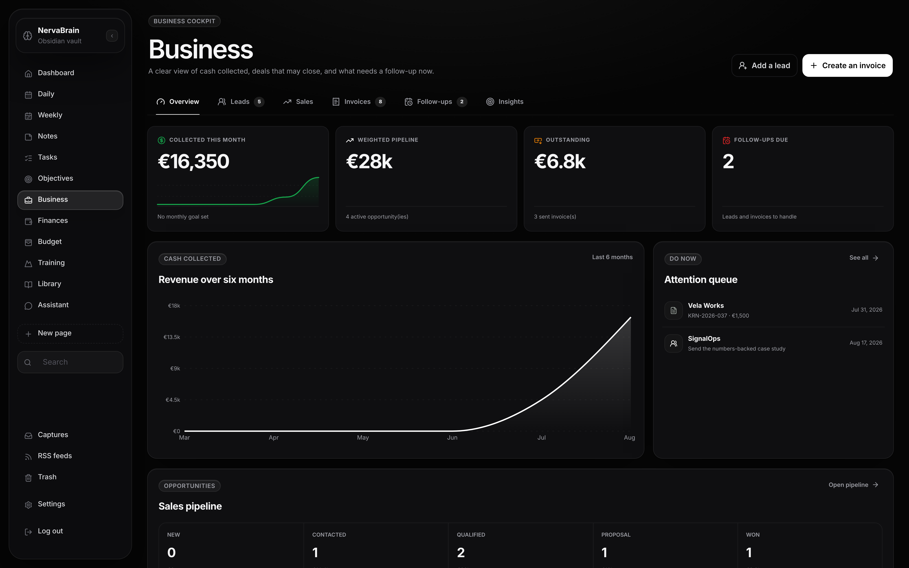
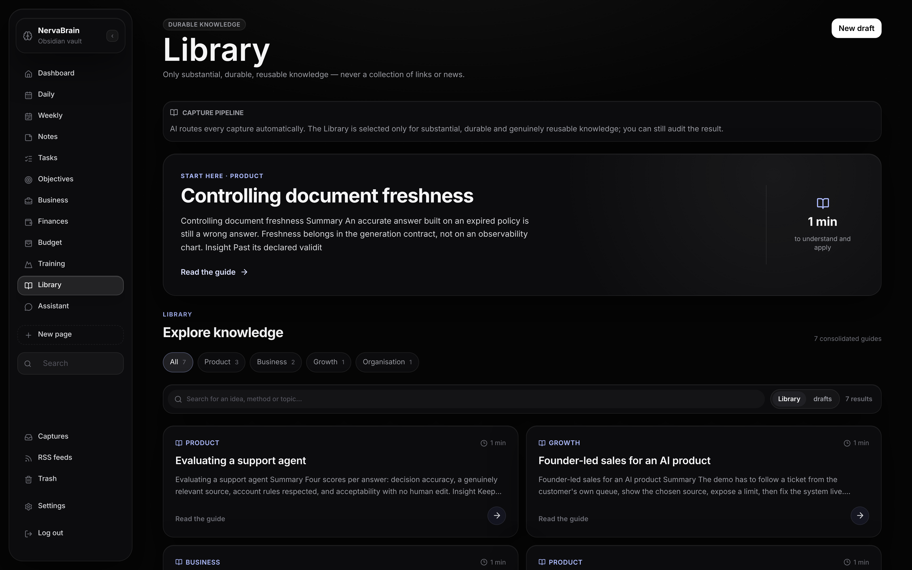

# Nerva Brain

Self-hosted AI second brain on top of a plain Markdown vault. The vault is the
database, Obsidian is the editor, Nerva Brain is the private web app: daily
brief, inbox, tasks, objectives, notes, and an assistant.



- **Your files stay files.** Markdown + YAML in `vault/`, syncable with Git,
  Syncthing, or rsync. No database, no cloud account.
- **AI is optional.** Connect Claude and/or ChatGPT-Codex for briefs, inbox
  triage, and weekly reviews. Every workflow has a local fallback.
- **Runs anywhere Docker runs**, including a Raspberry Pi.

## Quick start

```bash
git clone https://github.com/paulgdl9/nervabrain.git nerva
cd nerva
./scripts/init-env.sh          # generates .env + dashboard password
docker compose up -d --build
```

Open `http://localhost:3000/setup` and sign in with the password the script
printed. The wizard sets language and timezone, optionally connects an AI
engine, asks the questions that build your context, and turns on the modules
you want (training, finance, budget, RSS, custom pages). Then open `vault/` in
Obsidian.

Edit `.env` before starting Compose to change the bind address, port, timezone,
vault path, or UID/GID. Defaults: app on `127.0.0.1:3000`, `./vault` and
`./data` persisted.

### Connect an AI engine

Either paste an API key in the wizard (stored `0600` outside the vault and
Git), or log a CLI in once:

```bash
docker compose exec ai-bridge claude auth login
docker compose exec ai-bridge codex login --device-auth
```

Then use **Verify connection** in `/settings/assistant` to pick the primary
engine and its fallback, and the model for each.

### Develop

```bash
npm install && ./scripts/init-env.sh
npm run dev          # hot reload
npm run dev:empty    # first-run flow against a disposable vault
```

## Capture from anywhere

Set `CAPTURE_TOKEN` in `.env`, then post text from a phone shortcut, a script,
or any MCP client:

```bash
curl -sS -X POST http://127.0.0.1:3000/api/capture \
  -H "X-Capture-Token: $CAPTURE_TOKEN" -H "Content-Type: application/json" \
  -d '{"text":"A useful idea to process automatically"}'
```

The AI classifies it on its own: noise gets archived, the rest becomes a task,
a raw note, or durable wiki knowledge. You never pick a destination or tags.

The same automation runs on a schedule inside the app (RSS ingestion, inbox
retries, daily brief, weekly review on Mondays), and can be forced with
`POST /api/automation/daily`.

## How the AI part works

The app loads the skills versioned in `vault/09-Skills/` and sends them, plus
the relevant vault evidence, to the bundled bridge
([`bridge/memo-bridge.py`](bridge/memo-bridge.py)) which drives the Claude and
Codex CLIs. The bridge runs in its own container with the vault mounted
read-only, no application source, and no host port — so every write still goes
through the app's typed paths and your accept/reject gate. Proposed tasks pass
an AI duplicate check and a local similarity guard before creation.

## Security essentials

- Write endpoints fail closed until `CAPTURE_TOKEN` is a real secret. Machine
  clients use `Authorization: Bearer`.
- Dashboard writes work on localhost and behind Cloudflare Access; direct
  LAN/VPN access needs `ALLOW_SAME_ORIGIN_WRITES=true`.
- MCP OAuth: dynamic registration, pre-registered redirect URI, PKCE S256,
  single-use codes, opaque one-hour `read`/`write` tokens. The MCP endpoint
  exposes Markdown notes and note operations only, never source or runtime
  state.
- RSS fetching pins DNS per request, rejects private addresses on every
  redirect, caps redirects at 3 and bodies at 2 MiB.
- Each profile keeps its own `.env`, vault, AI sessions, and Garmin tokens.

## Deploy

```bash
./scripts/deploy-install.sh check    # then install, then status
```

The installer starts the stack and one host timer that redeploys a clean local
revision confirmed on `origin/main`, for every profile listed in
`data/tenants.conf` (copy `deploy/tenants.conf.example`). Optional Compose
profiles: `tunnel` (Cloudflare), `sync` (Syncthing), `backup` (Restic
snapshots of `vault` and `data` — set a strong `RESTIC_PASSWORD` and keep the
repository on another disk or in S3/SFTP).

## Screens

Daily brief, written from your own notes:



Tasks, with status, area and priority editable in place:



Training, fed by the twice-daily Garmin sync:



Finances, with automatic quotes for shares, ETFs and crypto:



Business, for whoever invoices their own clients:



Library, where a capture becomes a note worth keeping:



Regenerate these against a throwaway demo vault. The vault is written with
today's date, so the screenshots read as a system in use rather than one
abandoned last month:

```bash
python3 scripts/make-demo-vault.py /tmp/demo-vault
SECOND_BRAIN_VAULT=/tmp/demo-vault PORT=3200 npm run dev
node scripts/shoot-demo.mjs http://127.0.0.1:3200 docs/screenshots
```

## Documentation

| Guide | Contents |
| --- | --- |
| [`docs/SETUP_GUIDE.md`](docs/SETUP_GUIDE.md) | Step-by-step setup, Obsidian, AI, multi-device (FR) |
| [`docs/DEPLOYMENT.md`](docs/DEPLOYMENT.md) | Linux operations, isolated profiles, network exposure (FR) |
| [`docs/HERMES_AGENT.md`](docs/HERMES_AGENT.md) | Use Nerva Brain from Telegram or Discord through Hermes Agent (FR) |
| [`docs/OBSIDIAN_MCP.md`](docs/OBSIDIAN_MCP.md) | Obsidian Local REST API and MCP, diagnostics (FR) |
| [`CLAUDE.md`](CLAUDE.md) | Working contract for AI agents in this repo |

## License

[AGPL-3.0-only](LICENSE.md). Commercial use allowed; if you modify Nerva Brain
and expose it over a network, you must offer users the corresponding source
under the same license. The Nerva Brain name and logo are not licensed for
branding modified versions or third-party services.

Bug reports and feedback welcome. Code contributions are not accepted yet.
